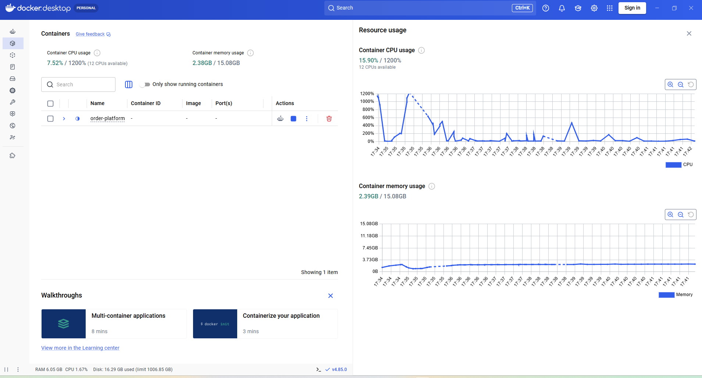
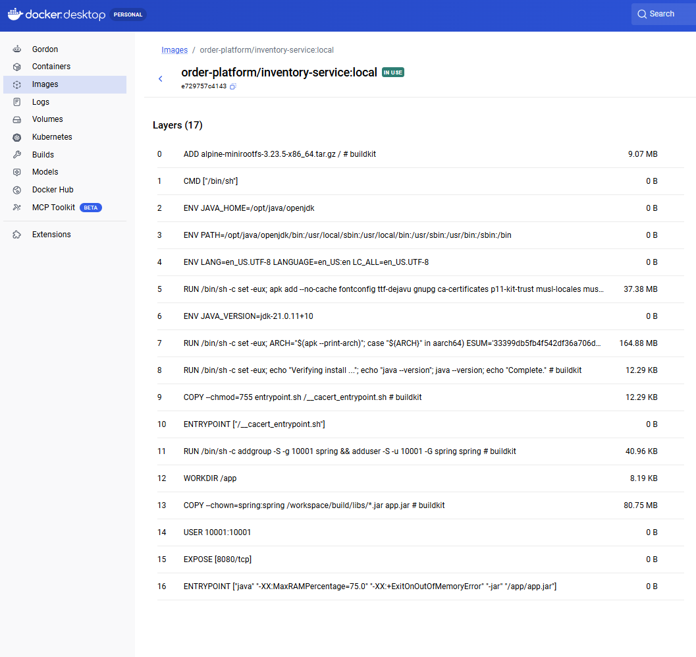
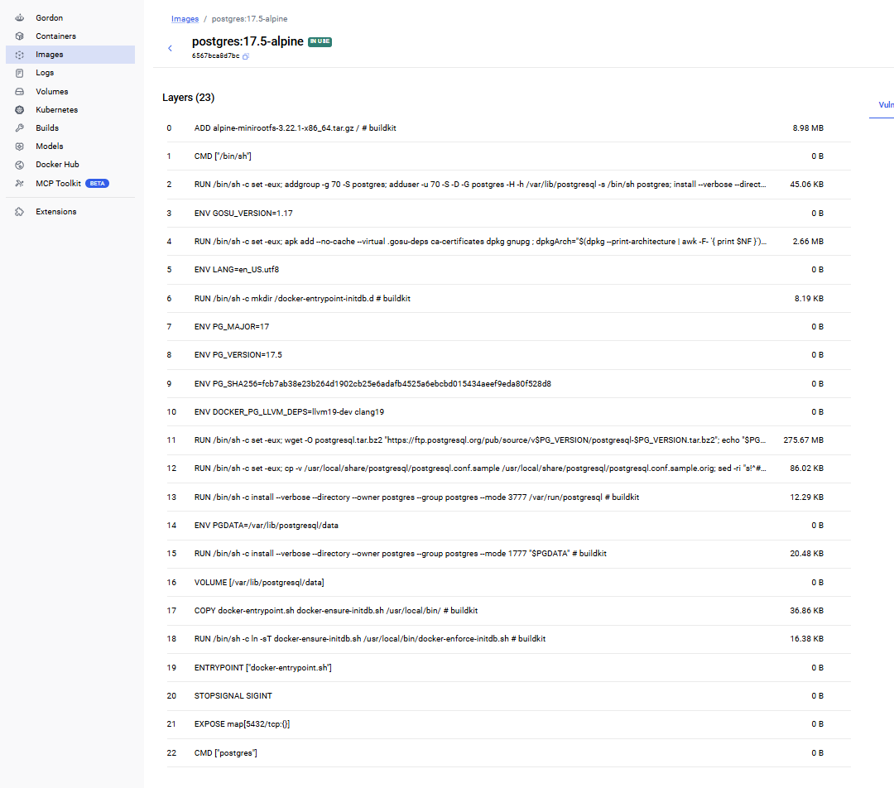
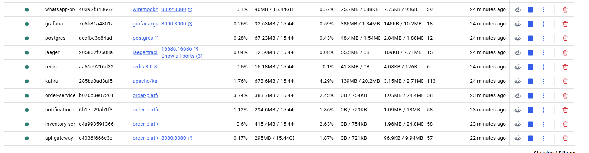
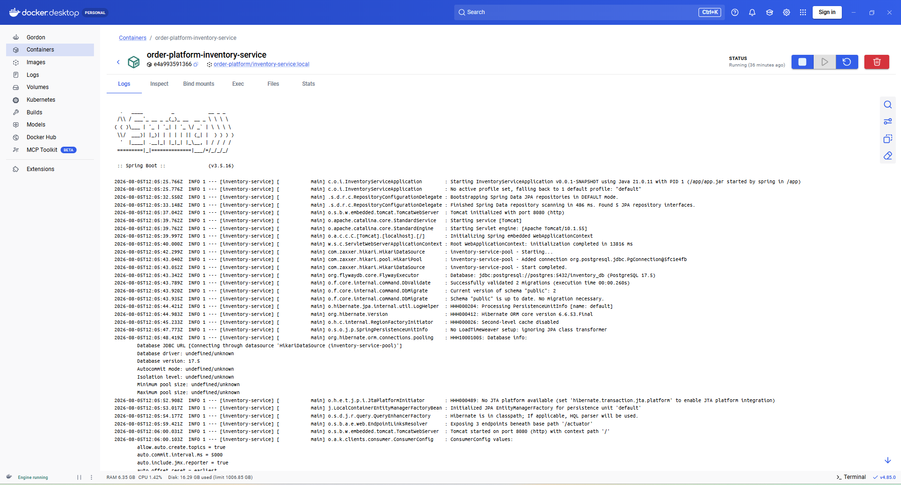
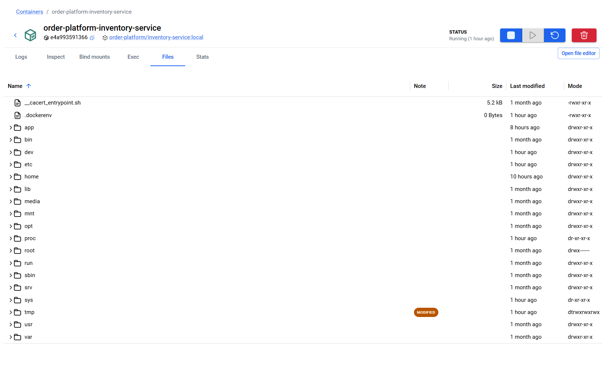
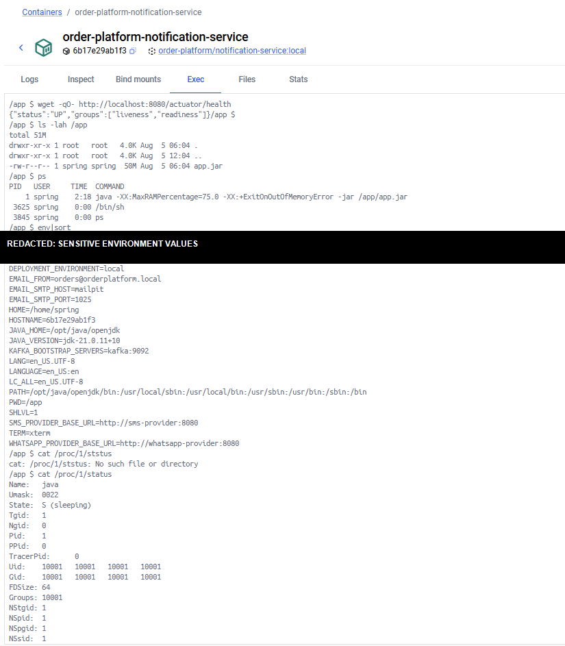
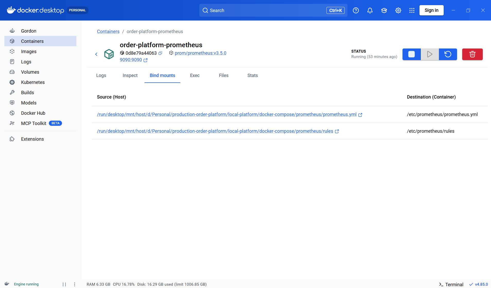

# Docker Desktop and Order Platform Notes

Last updated: 2026-08-05

This document records Docker Desktop concepts and observations for the local
Order Platform. Add future Docker and platform questions to this file as they
are investigated.

## Docker Desktop screenshot



## Why Docker Desktop shows one item

The `order-platform` row is a Docker Compose project. It is a group containing
all containers declared in
`local-platform\docker-compose\docker-compose.yml`.

Click the `>` icon beside `order-platform` to expand it. The project currently
contains these long-running containers:

| Container/service | Purpose |
|---|---|
| `api-gateway` | Public HTTP entry point and downstream circuit breaker |
| `order-service` | Creates, retrieves, and cancels orders |
| `inventory-service` | Maintains stock and handles reservations |
| `notification-service` | Dispatches email, SMS, and WhatsApp notifications |
| `postgres` | Stores order, inventory, and notification data |
| `kafka` | Carries asynchronous domain events |
| `redis` | Provisioned cache; currently unused by the applications |
| `prometheus` | Scrapes and stores application metrics |
| `grafana` | Displays Prometheus metrics in dashboards |
| `jaeger` | Trace UI and collector; applications are not yet instrumented |
| `mailpit` | Local email server and inbox UI |
| `sms-provider` | WireMock-based SMS provider simulator |
| `whatsapp-provider` | WireMock-based WhatsApp provider simulator |
| `toxiproxy` | Injects latency and network failures for resilience testing |

The parent Compose row has no container ID, image, or port because it represents
the entire project rather than an individual container.

## Services currently implemented

The repository currently contains:

- API Gateway
- Order service
- Inventory service
- Notification service

There is no Payment service in the repository or Compose configuration. If a
Payment service was created elsewhere, it must be added to this repository and
to `docker-compose.yml` before it appears under `order-platform`.

## Docker terminology

| Term | Meaning |
|---|---|
| Compose project | A group of related containers forming one application |
| Service | A component declared in `docker-compose.yml` |
| Image | An immutable packaged template used to create containers |
| Container | A running instance created from an image |
| Port | A network endpoint exposed internally or to the Windows host |
| Volume | Persistent data that survives container recreation |
| Network | An isolated communication boundary between containers |
| Health check | A command used to determine whether a container is ready |
| PID count | Processes and kernel threads currently running inside a container |

## Docker Images, Layers, and Image History

The Docker Desktop **Images** detail page shows how an image was assembled. It
describes the read-only package used to create containers; it does not show a
running application.

### Image compared with container

| Concept | Meaning |
|---|---|
| Image | Read-only packaged blueprint containing files and startup configuration |
| Container | A running or stopped instance created from an image |
| `IN USE` | At least one existing container currently references the image |
| Image ID | Content-derived identifier for a particular image build |
| Tag | Human-readable image reference such as `inventory-service:local` |

Multiple containers can be created from the same image. Each container receives
its own writable layer while the underlying read-only image layers are shared.

### What image layers mean



An image is assembled as an ordered history of Dockerfile instructions. The
bottom/base instructions appear first, followed by later customization.

Instructions that normally add or change filesystem content include:

- `ADD`: adds files, such as the Alpine Linux root filesystem.
- `COPY`: copies files into the image.
- `RUN`: executes a build command and records its filesystem changes.

Configuration instructions commonly show `0 B` because they primarily store
metadata:

- `ENV`: defines an environment variable.
- `USER`: chooses the user used for subsequent instructions and runtime.
- `EXPOSE`: documents an intended container port.
- `ENTRYPOINT`: defines the executable run when a container starts.
- `CMD`: provides the default command or default arguments.
- `STOPSIGNAL`: defines the signal Docker sends during graceful shutdown.

`EXPOSE 8080` or `EXPOSE 5432` does not publish a port to Windows. Port
publication is configured separately through Compose `ports`.

Docker caches and shares unchanged layers. If only application code changes,
base operating-system and Java layers can usually be reused. This reduces build
time and disk usage.

The layer list includes both filesystem-changing layers and zero-byte history
entries. Therefore, the displayed instruction count can be greater than the
number of physical filesystem layers.

### Inventory service image

The custom image is:

```text
order-platform/inventory-service:local
```

Its final runtime image is assembled as follows:

1. Start with Alpine Linux.
2. Install the Eclipse Temurin Java 21 runtime and certificates.
3. Create a non-administrator `spring` user with ID `10001`.
4. Set `/app` as the working directory.
5. Copy the built application JAR to `/app/app.jar`.
6. Select user `10001:10001`.
7. Document port `8080`.
8. Start the JVM and application JAR.

The startup instruction is:

```text
java -XX:MaxRAMPercentage=75.0 \
     -XX:+ExitOnOutOfMemoryError \
     -jar /app/app.jar
```

`-XX:+ExitOnOutOfMemoryError` terminates the JVM if it encounters an
out-of-memory error so the container can be restarted rather than remaining in
an unreliable state.

`-XX:MaxRAMPercentage=75.0` allows the JVM maximum heap calculation to use up
to 75 percent of the memory visible to the container. The application
containers currently have no explicit memory limits, so production deployment
should define appropriate container memory limits rather than allowing several
JVMs to independently size themselves against the larger Docker environment.

The largest application-owned layer is the copied Spring Boot JAR. Java and
Alpine layers come from the Eclipse Temurin base image.

### Multi-stage application build

The application Dockerfile uses two stages:

1. A builder stage uses the full Java Development Kit and Gradle to compile the
   source and create the Spring Boot JAR.
2. A runtime stage uses the smaller Java Runtime Environment and copies only
   the completed JAR.

The Gradle cache, compiler, source files, and full build environment are not
included in the final runtime image. This reduces image size and the production
attack surface.

### PostgreSQL image



The database uses the official image:

```text
postgres:17.5-alpine
```

Its important image-history steps are:

1. Start with Alpine Linux.
2. Create the `postgres` operating-system user.
3. Install required packages and PostgreSQL 17.5.
4. configure `PGDATA=/var/lib/postgresql/data`.
5. Declare the PostgreSQL data directory as a volume location.
6. Install `docker-entrypoint.sh`.
7. Configure graceful shutdown with `SIGINT`.
8. Document port `5432`.
9. Use `postgres` as the default command.

At startup, `docker-entrypoint.sh` prepares a new database directory when
needed, executes initialization scripts, and finally starts PostgreSQL.

The Compose project mounts a named volume at the PostgreSQL data location.
Consequently, database data survives container replacement even though the
container's own writable layer is disposable.

### Interpreting layer sizes

- A large `RUN`, `ADD`, or `COPY` layer usually contains real files such as a
  runtime, database binaries, operating-system packages, or an application JAR.
- A `0 B` layer normally records configuration metadata and is not an error.
- Deleting a file in a later layer does not remove its bytes from an earlier
  immutable layer.
- Multi-stage builds prevent build-only files from entering the final image.
- Different images can share identical base layers on disk.

## CPU information

The processor information was obtained from Windows with:

```powershell
Get-CimInstance Win32_Processor
```

The machine reports:

- Processor: Intel Core i7-1365U
- Physical cores: 10
- Logical processors: 12

Docker's allocation was checked with:

```powershell
docker info
```

Docker currently has access to all 12 logical processors. The Compose file does
not specify per-container CPU limits.

### Why Docker shows 1200 percent

Docker represents each logical CPU as 100 percent:

```text
1 logical CPU   = 100%
12 logical CPUs = 1200%
```

Examples:

- `100%` means approximately one logical CPU is fully occupied.
- `600%` means approximately six logical CPUs are fully occupied.
- `1200%` means all twelve logical CPUs are fully occupied.

Therefore, a reading such as `15.9% / 1200%` is low overall usage. It is not
15.9 percent of the complete machine.

### Why the left CPU value and chart can differ

The values can use different scopes and sampling times:

- The left value is a current summary for the displayed containers/project.
- The right chart is a sampled time series for the selected item.
- The two panels may refresh at slightly different moments.
- Short Java, Kafka, health-check, Prometheus, or garbage-collection bursts can
  change CPU usage between samples.

Large CPU spikes during startup are expected while JVMs start, Spring creates
application contexts, Flyway runs migrations, database pools connect, Kafka
consumers join groups, and Java performs just-in-time compilation. Sustained
high CPU after startup is more important than a short startup spike.

## Memory information

The host has approximately 32 GB of physical RAM. Docker's Linux environment
currently sees approximately 15 GB.

The Compose file does not define memory limits for the application containers.
The total shown in Docker Desktop comes from Docker Desktop/WSL resource
allocation rather than from an application setting.

Memory should be investigated when:

- Usage grows continuously and does not return after garbage collection.
- A container is killed with an out-of-memory error.
- Containers approach an explicitly configured memory limit.
- Swap or host memory pressure makes the applications slow.

## PIDS in Docker Desktop



`PID` means **Process Identifier**. A Linux kernel assigns a numeric identifier
to each process. Threads also have individual task/thread identifiers.

Docker Desktop's `PIDS` column does not display those individual identifiers.
It displays the **current count** of Linux processes and kernel tasks/threads
inside the container.

The observed application values were:

| Container | PIDS | Actual process summary |
|---|---:|---|
| Order service | 58 | One Java process with 58 live threads |
| Notification service | 58 | One Java process with 58 live threads |
| Inventory service | 58 | One Java process with 58 live threads |
| API Gateway | 57 | One Java process with 57 live threads |

These are not 58 application instances, 58 busy threads, or a maximum capacity
of 58. They mean that 58 JVM threads currently **exist**. At a particular
moment, each thread may be:

- Running on a CPU
- Waiting for an HTTP request
- Waiting for a Kafka message
- Waiting for database or network I/O
- Sleeping
- Performing garbage collection or other JVM work

Usually, only a small subset is actively executing at the same instant.

One Java service container is one application instance, but its JVM can create
many threads for:

- HTTP request handling
- Kafka consumers and producers
- Database connection pooling
- Scheduled outbox publishing
- Garbage collection
- JVM internal work

To run three instances of `order-service`, three containers must be running.
A PIDS value of three does not mean three application instances.

The three Spring MVC services show the same value because they use similar
Spring, Tomcat, Kafka, database-pool, scheduler, and JVM components. This is an
observed runtime coincidence, not a special allocation of exactly 58 threads.
The API Gateway uses reactive Netty instead of Tomcat, which helps explain its
slightly different count.

The PIDS count can increase when components create additional threads under
load, and it can decrease when idle threads are retired. However, the threads
are not one interchangeable pool. Tomcat, Netty, Kafka, HikariCP, schedulers,
and the JVM each manage their own threads and limits.

Docker inspection showed that no container-level PID limit is configured.
Therefore, `PIDS = 58` reports current live tasks; it does not report how many
threads remain available or the maximum load the application can handle.

## Container Logs and Spring Startup



The Docker Desktop **Logs** tab shows text written by the containerized
application to standard output and standard error. For this platform, these are
primarily Spring Boot and application logs.

### Container header and controls

The inventory-service page shows:

- `order-platform-inventory-service`: container name.
- A shortened value such as `e4a993591366`: container ID.
- `order-platform/inventory-service:local`: image used to create the container.
- `Running`: current container state.

The action buttons stop, start, restart, or delete the container. Deleting a
container removes that runtime instance; it does not automatically delete its
image or named volumes.

### Reading a Spring log line

An example structure is:

```text
2026-08-05T12:05:25.766Z INFO 1 --- [inventory-service] [main] class : message
```

| Part | Meaning |
|---|---|
| Timestamp ending in `Z` | Time in UTC |
| `INFO` | Log severity |
| `1` | Java process ID inside the container |
| `[inventory-service]` | Spring application name |
| `[main]` | Thread that emitted the message |
| Class/logger name | Component that emitted the message |
| Message | Description of the event |

India Standard Time is UTC+05:30, so `12:05 UTC` is approximately `17:35 IST`.

Common log levels are:

- `TRACE`: extremely detailed diagnostics.
- `DEBUG`: developer-oriented diagnostic details.
- `INFO`: expected lifecycle and business events.
- `WARN`: unusual condition that did not necessarily fail the operation.
- `ERROR`: an operation failed.
- Exception stack trace: the chain of calls and causes behind a failure.

### Inventory service startup sequence

The visible logs record a successful startup:

1. Java 21 starts the Spring Boot inventory application.
2. Spring selects the default profile.
3. Spring Data discovers JPA repositories.
4. Embedded Tomcat initializes on container port `8080`.
5. The Spring application context is created.
6. HikariCP creates the database connection pool.
7. The service connects to PostgreSQL database `inventory_db`.
8. Flyway validates the database migrations and finds the schema up to date.
9. Hibernate initializes JPA and its entity manager.
10. Actuator exposes health, information, and Prometheus endpoints.
11. Tomcat begins accepting HTTP requests.
12. Kafka consumers connect and join their consumer groups.

The Docker Desktop tabs have different purposes:

| Tab | Purpose |
|---|---|
| Logs | Application standard output and errors |
| Inspect | Runtime configuration, environment, network, health, and metadata |
| Bind mounts | Host files or directories shared with the container |
| Exec | Run a command or open a shell inside the container |
| Files | Browse the container filesystem |
| Stats | CPU, memory, network, disk I/O, and PIDS |

### JTA platform message

JTA means **Jakarta Transactions API**. It can coordinate one atomic
transaction across multiple XA-compatible resources, such as two databases or
a database and transactional message broker. This is a distributed transaction
and is commonly implemented with two-phase commit.

The Hibernate message:

```text
No JTA platform available
```

is informational for this platform, not a startup error. Each service uses a
normal local Spring database transaction. Cross-service consistency uses:

```text
Local database transaction
  -> transactional outbox
  -> Kafka
  -> idempotent consumer/inbox
  -> saga state transition or compensation
```

Modern microservices generally prefer this outbox/Kafka/saga approach because
services stay independently deployable. It provides eventual consistency, such
as an order briefly being `PENDING` before becoming `CONFIRMED`. JTA/XA remains
appropriate in some tightly controlled enterprise systems where immediate
atomicity across several compatible resources is mandatory.

## Container Filesystem



The Docker Desktop **Files** tab shows the Linux filesystem visible inside the
running container. It combines:

1. Read-only filesystem layers inherited from the Docker image.
2. The container's temporary writable layer.
3. Any bind mounts or named volumes attached at particular paths.
4. Virtual filesystems mounted by the Linux kernel when the container starts.

The inventory service currently has no bind mounts or named volumes, so its
application files come from the image and runtime changes go to its disposable
writable layer.

### Important directories

| Path | Purpose |
|---|---|
| `/app` | Inventory application directory containing `app.jar` |
| `/opt` | Optional software; Java is under `/opt/java/openjdk` |
| `/bin`, `/sbin` | Essential Linux commands and administrative utilities |
| `/usr` | Installed programs, libraries, and shared resources |
| `/lib` | Shared libraries required by programs |
| `/etc` | Operating-system and application configuration |
| `/tmp` | Temporary files; normally writable and disposable |
| `/var` | Changing runtime data, caches, logs, and service data |
| `/home` | Home directories for normal users |
| `/root` | Root administrator's home directory |
| `/run` | Runtime state such as process or service metadata |
| `/mnt`, `/media` | Conventional locations for mounted storage or media |
| `/dev` | Device interfaces exposed by the kernel |
| `/proc` | Live process and runtime kernel information |
| `/sys` | Structured kernel, device, and resource-control information |

The inventory application starts from:

```text
/app/app.jar
```

using Java from:

```text
/opt/java/openjdk/bin/java
```

### Special files

`/__cacert_entrypoint.sh` comes from the Eclipse Temurin Java base image. It
prepares Java certificate trust configuration before starting the application.

`/.dockerenv` is a marker created by Docker that indicates the process is
running in a container environment.

Docker Desktop may mark `/tmp` as `MODIFIED` because the JVM or application
created temporary runtime files there. That change belongs to the container's
writable layer.

### Why some files are older than the project

The displayed modification time belongs to the file or directory itself, not
to the date this repository was created.

- Files showing approximately one month old were inherited from Alpine Linux or
  the Eclipse Temurin Java base image.
- Files showing hours old were created when the application image was built.
- Files showing the container start time were generated or mounted at runtime.
- `MODIFIED` means the running container changed that path relative to the
  original image.

Docker preserves timestamps from downloaded base-image layers and reuses cached
layers. Rebuilding the project does not recreate unchanged Linux or Java files.

### File permissions

An example mode is:

```text
drwxr-xr-x
```

The first character describes the object:

- `d`: directory.
- `-`: regular file.
- `l`: symbolic link.

The remaining characters form three permission groups:

```text
owner | group | everyone else
 rwx  |  r-x  |      r-x
```

- `r`: read.
- `w`: write.
- `x`: execute a file or enter/traverse a directory.

The applications run as non-root user `10001:10001`. Permissions therefore
determine whether that user can read, write, or execute each path.

### Persistence and safe editing

Changes made directly through the Files tab or an Exec shell normally belong to
the container's writable layer:

```text
Delete/recreate container
  -> writable-layer changes disappear
  -> original image files return
```

Files in bind mounts or named volumes follow their own persistence rules.
Docker Desktop's file editor is useful for inspection and temporary debugging,
but permanent code or configuration changes should be made in the repository,
Dockerfile, mounted configuration, or deployment system.

### `/dev`: device interfaces

`dev` means **devices**. `/dev` contains special device files through which
programs interact with kernel-provided utilities and permitted devices. They
are interfaces, not ordinary files stored in the image.

| Path | Purpose |
|---|---|
| `/dev/null` | Discards anything written to it |
| `/dev/zero` | Produces zero bytes |
| `/dev/random` | Supplies kernel-generated random data |
| `/dev/urandom` | Supplies non-blocking random data |
| `/dev/stdin` | Standard input stream |
| `/dev/stdout` | Standard output stream |
| `/dev/stderr` | Standard error stream |
| `/dev/tty` | Current terminal |
| `/dev/shm` | Shared-memory filesystem |

For example:

```sh
echo "discard this" > /dev/null
```

Docker captures data written by the application to `/dev/stdout` and
`/dev/stderr` and displays it in the Logs tab.

Containers receive a restricted device set by default. Hardware such as GPUs,
serial ports, or USB devices requires explicit configuration. Broad device
access is security-sensitive.

Linux normally has `/dev`, not a standard root-level `/devices` directory.
`/sys/devices` is a different path that describes the kernel's device
hierarchy.

### `/proc`: processes and live kernel information

`proc` means **process information**. `/proc` is generated dynamically by the
kernel and provides a live view of processes and selected runtime information.

Each visible process has a numeric directory:

```text
/proc/1
/proc/25
/proc/100
```

The number is the process PID. The Java application is PID `1` inside its
container, so its details appear under `/proc/1`.

| Path | Purpose |
|---|---|
| `/proc/1/cmdline` | Command used to start process 1 |
| `/proc/1/status` | Process state, memory, thread count, and permissions |
| `/proc/1/environ` | Environment variables received by the process |
| `/proc/1/fd` | Open file descriptors, files, pipes, and sockets |
| `/proc/self` | The current process's own `/proc` directory |
| `/proc/cpuinfo` | CPU information visible in the environment |
| `/proc/meminfo` | Memory information |
| `/proc/uptime` | Runtime uptime information |
| `/proc/mounts` | Mounted filesystems |
| `/proc/net` | Network protocol and connection statistics |
| `/proc/sys` | Runtime kernel parameters |

The Docker PIDS observation can be correlated with:

```text
/proc/1/status
```

which may contain:

```text
Threads: 58
```

`/proc` helps diagnose the process command, threads, environment, memory, open
files, sockets, and mounts. Container namespaces and control groups determine
which host information is visible.

### `/sys`: kernel structure and resource controls

`/sys` is the **sysfs** virtual filesystem. It presents kernel objects in a
structured hierarchy, including devices, drivers, network interfaces, block
storage, kernel modules, and control groups.

| Path | Purpose |
|---|---|
| `/sys/devices` | Kernel device hierarchy |
| `/sys/class/net` | Network interfaces such as `eth0` |
| `/sys/class/block` | Block-storage devices |
| `/sys/fs/cgroup` | Resource accounting and limits for containers |
| `/sys/module` | Loaded kernel modules |
| `/sys/bus` | Devices grouped by bus type |

Docker relies on Linux control groups under `/sys/fs/cgroup` to account for or
limit:

- CPU
- Memory
- Process/PID count
- Disk and other I/O

Docker Desktop uses this type of runtime information to produce container
resource statistics.

### `/dev`, `/proc`, and `/sys` compared

```text
/dev  -> interfaces used to interact with devices and standard streams
/proc -> live process and runtime kernel information
/sys  -> structured devices, drivers, and resource-control information
```

Using a network interface as an example:

```text
/proc/net         -> current protocol and network statistics
/sys/class/net    -> network-interface properties and structure
```

These paths are not packaged with normal contents in the Docker image. Docker
and the Linux kernel mount and populate them when the container starts, which
is why their timestamps may resemble the container start time.

Reading these files for diagnostics is normal. Writing to them can change
process, device, or kernel behavior, may be blocked inside a container, and can
create security risks. For normal microservice development, detailed knowledge
is unnecessary; the most practically useful paths are:

```text
/app
/etc
/tmp
/var
/dev/stdout
/dev/stderr
/dev/null
/proc/1/status
/proc/1/cmdline
/proc/1/fd
/sys/fs/cgroup
```

## Exec: Debugging Inside a Running Container



Docker Desktop's **Exec** tab runs commands inside an already-running
container. It is similar to opening a terminal on a small isolated Linux
computer where the application is running.

```text
Windows terminal     -> command runs on Windows
Docker Exec terminal -> command runs inside the selected container
```

The command-line equivalent is:

```powershell
docker exec -it order-platform-notification-service sh
```

`docker exec` starts an additional temporary process inside the existing
container. The main Java application continues running as PID `1`, while the
Exec shell and each diagnostic command receive additional PIDs. The Docker
PIDS count can therefore increase temporarily while Exec is open.

### Primary purpose

Exec is mainly for live debugging and investigation:

- Verify that the application is responding internally.
- Inspect packaged files and permissions.
- Confirm the expected process is running.
- Inspect environment configuration.
- Check threads, memory, open files, and process state.
- Test container-to-container DNS and network connectivity.
- Run a database client or other diagnostic command.

It is not intended for permanent application changes.

### Five useful debugging commands

#### 1. Test the application health endpoint

```sh
wget -qO- http://localhost:8080/actuator/health
```

| Part | Meaning |
|---|---|
| `wget` | Command-line HTTP client |
| `-q` | Quiet mode; suppress progress output |
| `-O` | Select the output destination |
| Final `-` | Write the HTTP response to the terminal |
| `localhost` | The same container |
| `8080` | Application's internal HTTP port |
| `/actuator/health` | Spring Boot health endpoint |

An `UP` response proves that the application is answering inside its container.
It does not by itself prove that the API Gateway or Windows host can reach it.

The letter in `-O` is uppercase `O`, not zero. Using `-0` causes an invalid
option error.

#### 2. Inspect application files and permissions

```sh
ls -lah /app
```

This confirms that `/app/app.jar` exists and shows file ownership, permissions,
and size.

#### 3. Inspect running processes

```sh
ps
```

The Java application should appear as PID `1`. The output may also show the
current Exec shell and the temporary `ps` command itself.

#### 4. Inspect environment variables

```sh
env | sort
```

This confirms database, Kafka, provider, deployment, Java, and path settings.
Environment output may contain passwords, tokens, connection strings, or other
secrets. Do not share or store it without redaction. The screenshot in these
notes has its database password redacted for that reason.

#### 5. Inspect the main process

```sh
cat /proc/1/status
```

This shows the Java process name, state, PID, user/group IDs, memory, security
settings, and thread count. To display only the thread count:

```sh
grep Threads /proc/1/status
```

A state such as:

```text
State: S (sleeping)
```

is usually normal. It means the process is waiting for work or an event rather
than consuming CPU continuously.

Paths and command names must be exact. For example, `/proc/1/ststus` fails
because the correct name is `/proc/1/status`.

### Saving temporary output and permission denied

To save an HTTP response:

```sh
wget -q -O /tmp/response.json http://localhost:8080/actuator/health
cat /tmp/response.json
```

The application runs as non-root user `10001`, named `spring`. `/app` is owned
by `root` and is not writable by that user, even though `app.jar` itself is
owned by `spring`. Attempting to create `/app/response.json` therefore returns
`Permission denied`.

`/tmp` is intentionally writable and is the correct location for disposable
debugging files. Avoid changing `/app` permissions to work around the error;
the restriction protects packaged application files from runtime modification.

Useful permission checks are:

```sh
id
pwd
ls -ld /app /tmp
```

### Exec limitations and production safety

- Exec only works while the container is running.
- Commands use the container's configured user unless another user is
  explicitly selected.
- Minimal images may contain `sh` but not `bash`.
- Diagnostic tools may be intentionally absent from small production images.
- Changes to the container writable layer disappear when it is recreated.
- Installing packages or editing code through Exec does not update the image.

Do not use Exec as a permanent way to modify code, configuration, permissions,
or database files. Make lasting fixes in the repository, Dockerfile, deployment
configuration, bind mount, ConfigMap, Secret, or volume and then redeploy.

Production Exec access should be restricted and audited because it grants
direct access to the running environment and may expose sensitive
configuration.

## Bind Mounts, Volumes, and Persistent Data

A container has its own isolated filesystem. Mounts solve the problem of giving
the container access to files that must come from outside that disposable
filesystem or survive container replacement.

Both bind mounts and volumes expose disk-backed files or directories inside a
container. They are storage, not RAM.

### Bind mount

A bind mount shares an exact file or directory from the host computer:

```text
Host file or directory <-> path inside container
```

For local development, the host is the developer's Windows computer. For a
single production server, the host is that production VM or physical server.
A bind mount does not create storage; it exposes an existing host path.

Use a bind mount when the host owns a file but the container needs to read or
modify it, for example:

- Editable Prometheus configuration and rules.
- Grafana dashboard definitions.
- WireMock request/response mappings.
- PostgreSQL initialization scripts.
- Load-test scripts.
- Development source code for live reload.

Application binaries should normally be packaged into an image rather than
bind-mounted, so the same tested image runs consistently in every environment.

### Prometheus bind-mount example



The platform maps:

```text
Windows prometheus\prometheus.yml -> /etc/prometheus/prometheus.yml
Windows prometheus\rules          -> /etc/prometheus/rules
```

Prometheus reads the first mount to learn which services to scrape and how
frequently. It reads the second mount to load latency, error, CPU, heap, and
other recording rules.

Docker Desktop displays a Windows path through its internal Linux form:

```text
/run/desktop/mnt/host/d/Personal/...
```

That represents the corresponding `D:\Personal\...` Windows path. The files
physically remain on the Windows disk. The Compose suffix `:ro` makes a mount
read-only from the container.

The inventory service has an empty Bind Mounts tab because its Java application
JAR is packaged into its image and it does not require host files.

### Can application configuration use a bind mount?

Yes. A Spring `application.yml` containing retry or provider settings could be
bind-mounted into a container. However:

- The application may require a restart to reload the file.
- Environment variables are simpler for a small number of values.
- Secrets should use a secret manager rather than an ordinary bind-mounted
  file.
- Centralized configuration systems may be preferable at larger scale.

### Docker named volume

A named volume is storage created and managed by Docker:

```text
Docker-managed volume <-> path inside container
```

It is independent of the repository directory and is normally used for durable
application data. In Docker Desktop with the Linux/WSL engine, its files live
inside Docker Desktop's managed Linux storage rather than as a normal project
folder. It can be viewed and managed through Docker Desktop's **Volumes** page.

### Bind mount compared with named volume

| Bind mount | Named volume |
|---|---|
| Uses an exact host path | Created and managed by Docker |
| Easy to edit directly on the host | Not intended for direct manual editing |
| Tied to the host directory layout | Independent of the project path |
| Good for configuration and scripts | Good for durable application data |
| Can be read-only with `:ro` | Usually read/write for the application |

A useful analogy is:

```text
Bind mount = instructions supplied from a known folder
Volume     = durable filing cabinet managed by Docker
```

### PostgreSQL uses both

The Compose configuration contains:

```yaml
volumes:
  - postgres-data:/var/lib/postgresql/data
  - ./postgres/init:/docker-entrypoint-initdb.d:ro
```

The named volume:

```text
order-platform-postgres-data -> /var/lib/postgresql/data
```

contains PostgreSQL's actual databases, tables, rows, indexes, and transaction
files. It survives PostgreSQL container deletion and recreation.

The bind mount:

```text
Windows postgres\init -> /docker-entrypoint-initdb.d
```

contains initialization scripts. The official PostgreSQL entrypoint reads them
when creating a new database in an empty data volume.

The `VOLUME /var/lib/postgresql/data` entry visible in the PostgreSQL image
history declares the intended persistent-data location. Compose explicitly
attaches the named `postgres-data` volume to that location.

### PostgreSQL image, container, application, and data

PostgreSQL is still an application. Docker changes how it is packaged and run:

```text
PostgreSQL image
  -> creates a PostgreSQL container
  -> container runs the PostgreSQL application
  -> application reads/writes the named data volume
```

The image contains PostgreSQL binaries and startup instructions. Database rows
are not stored in the image. The data is stored in
`order-platform-postgres-data`.

In Docker Desktop, open:

```text
Volumes -> order-platform-postgres-data
```

The raw files are PostgreSQL's internal format and should not be manually
edited. View logical data through PostgreSQL instead:

```powershell
docker exec -it order-platform-postgres `
  psql -U order_service -d order_db
```

Useful `psql` commands include:

```sql
\dt
SELECT * FROM orders;
SELECT * FROM order_items;
SELECT * FROM outbox_events;
```

Equivalent database names are `inventory_db` with user `inventory_service` and
`notification_db` with user `notification_service`.

### Storage lifecycle

```text
Delete PostgreSQL container -> named-volume data remains
Recreate PostgreSQL container -> existing volume is reattached
Rebuild PostgreSQL image -> named-volume data remains
Delete PostgreSQL named volume -> database data is lost
```

A volume provides persistence, but it is not a backup. Production systems still
need scheduled backups, retention, restore procedures, and recovery testing.

### Production equivalents

On one production VM, a bind mount can expose a carefully managed server path.
That path may be on local server disk, attached cloud disk, or a mounted network
filesystem. The drawback is that the container becomes tied to that server and
path.

Production clusters therefore usually select storage by purpose:

| Content | Common production mechanism |
|---|---|
| Application code | Container image |
| Small settings | Environment variables |
| Configuration files | Kubernetes ConfigMap or equivalent |
| Credentials/certificates | Kubernetes Secret or cloud secret manager |
| PostgreSQL/Kafka/Prometheus data | Persistent Volume backed by managed storage |
| Shared files | Cloud or network filesystem |
| Exact node-specific path | Host bind mount, used carefully |

A Kubernetes Persistent Volume may be backed by Azure Disk, AWS EBS, or another
cloud storage service. ConfigMaps and Secrets can also appear as mounted files
inside containers, but they are not ordinary application-data volumes.

Production may also use a managed database such as Azure Database for
PostgreSQL instead of running a PostgreSQL container. In that case, the cloud
provider manages the database hosts and underlying storage while the
applications connect over the network.

## One-time initialization containers

### `kafka-init`

`kafka-init` waits for Kafka to become healthy, creates the required topics, and
then exits.

Topics include:

```text
orders.placed.v1
inventory.reservation-results.v1
inventory.release-requested.v1
inventory.released.v1
notifications.requested.v1
notifications.requested.v1.dlt
```

Its observed state was `Exited (0)`. Exit code `0` means the initialization
completed successfully. It is not supposed to remain running.

### `toxiproxy-init`

`toxiproxy-init` waits for the order service and Toxiproxy, creates the
order-service proxy, and then exits:

```text
API Gateway -> Toxiproxy:8666 -> Order Service:8080
```

Its observed state was also `Exited (0)`. The one-time setup container stops,
while the main `toxiproxy` container remains running.

For initialization containers:

- `Exited (0)` means successful completion.
- A nonzero exit code means initialization failed.
- Repeated restarting usually means a configuration or dependency problem.
- Running indefinitely is unexpected for these two initialization jobs.

## Platform startup behavior

Compose starts independent dependencies in parallel but honors declared health
and completion dependencies:

1. PostgreSQL, Kafka, provider simulators, and observability components start.
2. `kafka-init` creates Kafka topics.
3. Order, inventory, and notification services run migrations and become ready.
4. `toxiproxy-init` configures the order-service proxy.
5. The API Gateway starts after downstream services are healthy.

Observed application startup durations:

| Application | Startup time |
|---|---:|
| Notification service | 29 seconds |
| Inventory service | 36 seconds |
| Order service | 39 seconds |
| API Gateway | 13 seconds |

## Observability links

| Tool | Link | Notes |
|---|---|---|
| Grafana | http://localhost:3000/d/order-platform-service-overview/order-platform-service-overview | Login: `admin` / `local-grafana-password` |
| Prometheus | http://localhost:9090 | Query raw and recorded metrics |
| Prometheus targets | http://localhost:9090/targets | All expected targets should be `UP` |
| Prometheus rules | http://localhost:9090/rules | Shows recording-rule state |
| Jaeger | http://localhost:16686 | Application traces are not yet emitted |
| Gateway health | http://localhost:8080/actuator/health | Gateway health endpoint |
| Gateway metrics | http://localhost:8080/actuator/prometheus | Raw gateway metrics |
| Mailpit | http://localhost:8025 | Email inbox |
| SMS requests | http://localhost:9091/__admin/requests | WireMock request journal |
| WhatsApp requests | http://localhost:9092/__admin/requests | WireMock request journal |
| Toxiproxy | http://localhost:8474/proxies | Configured fault-injection proxies |

The downstream application actuator endpoints are internal to Docker networks
and are collected through Prometheus.

## Order request flow

The successful order path is:

```text
Client
  -> API Gateway
  -> Order service
  -> Order database transaction
     -> order saved as PENDING
     -> OrderPlaced event saved in order outbox
  -> HTTP 201 returned
  -> order outbox publisher
  -> Kafka topic orders.placed.v1
  -> Inventory service
     -> inventory reserved
     -> InventoryReserved event saved in inventory outbox
  -> Kafka topic inventory.reservation-results.v1
  -> Order service
  -> order changed from PENDING to CONFIRMED
```

The important production behavior is that HTTP `201 Created` means the order
was durably accepted, not that the complete asynchronous saga has finished.
Clients must retrieve the order until it reaches `CONFIRMED` or `REJECTED`.

An observed request:

- Order ID: `bad8baf1-cfb4-49ce-aa28-52d40f80cbef`
- Initial state: `PENDING`
- Final state: `CONFIRMED`
- Saga transition time: approximately 1 second
- Inventory reserved: 3 units
- Order outbox publication attempts: 1
- Inventory outbox publication attempts: 1
- Relevant Kafka consumer lag after completion: 0
- Follow-up SMS provider calls: 1 accepted

The current order saga does not automatically produce notification events. The
notification flow was exercised separately by publishing a notification event
to Kafka.

## What to check regularly

1. Expand `order-platform` and confirm required long-running containers are
   `Running`.
2. Confirm application and infrastructure health checks say `healthy`.
3. Treat `Exited (0)` as correct for `kafka-init` and `toxiproxy-init`.
4. Look for restart loops or increasing restart counts.
5. Inspect logs for `ERROR`, exceptions, database failures, Kafka failures, and
   outbox publication errors.
6. Use Grafana to watch request rate, errors, latency, CPU, heap, GC, Tomcat
   threads, and database pool usage.
7. Use Prometheus targets to confirm every metrics scrape is `UP`.
8. Check Kafka consumer lag after traffic spikes; persistent lag means consumers
   cannot keep up with producers.
9. Watch sustained CPU and continuously growing memory rather than isolated
   startup spikes.
10. Monitor Docker disk usage because images, PostgreSQL, Kafka, Prometheus, and
    volumes accumulate data.

## Current observability gaps

- Application OpenTelemetry tracing is not configured, so Jaeger does not show
  end-to-end application traces.
- There is no centralized log aggregation UI.
- Prometheus does not currently scrape dedicated PostgreSQL, Kafka, or Redis
  exporters.
- Redis is provisioned but currently unused by the applications.
