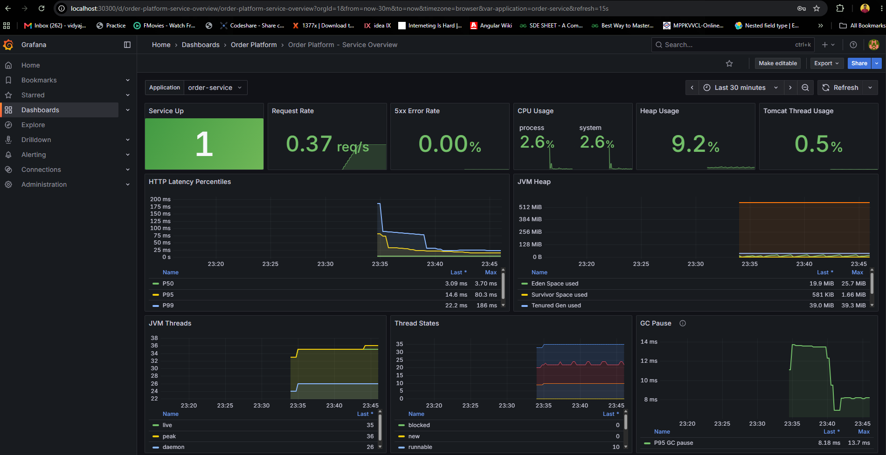
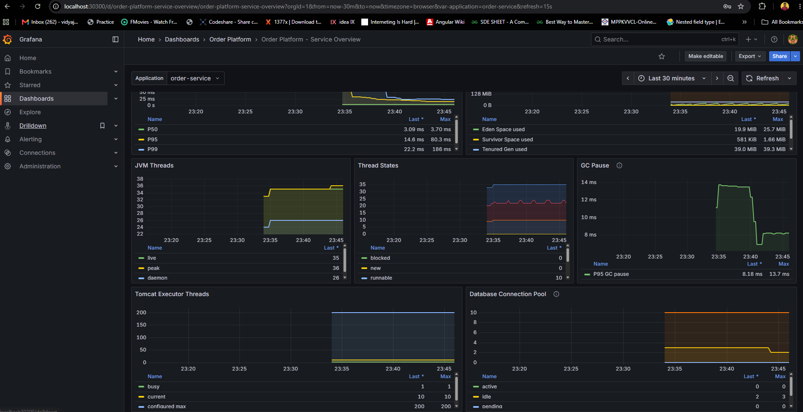
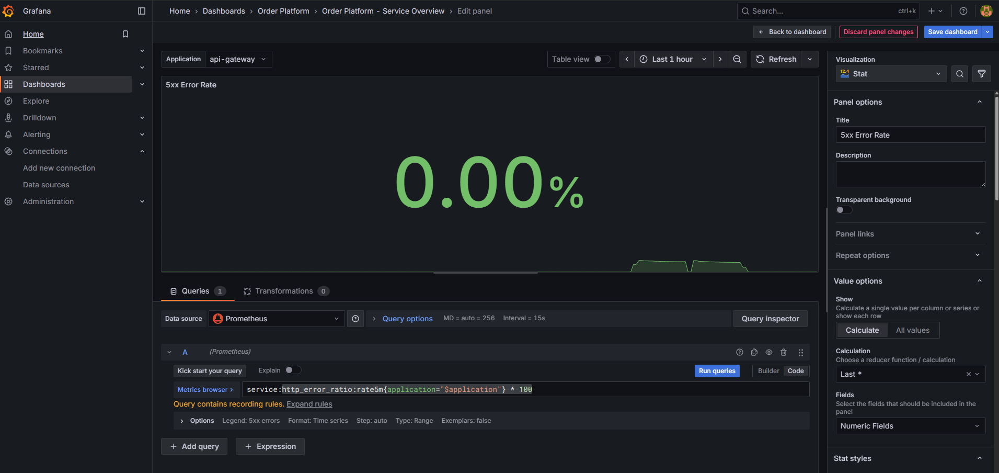
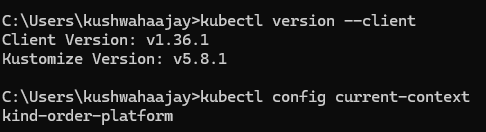
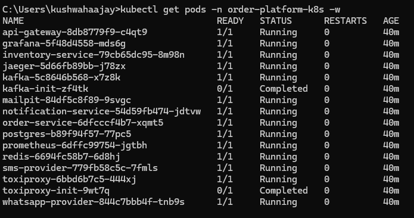
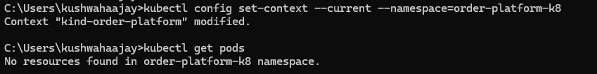

# Order Platform — Observability & CLI Notes

Hands-on learning notes for observing the **Kubernetes** deployment of the Order
Platform: the Grafana **Service Overview** dashboard, the everyday **kubectl**
commands, and answers to the questions that came up while exploring it.

The platform runs on a local **kind** cluster (context `kind-order-platform`,
namespace `order-platform-k8s`).

**Contents**
1. [Where to observe (the 3 layers)](#where-to-observe-the-3-layers)
2. [Grafana Service Overview — every panel explained](#grafana-service-overview--every-panel-explained)
3. [Running the CLI yourself](#running-the-cli-yourself)
4. [Common kubectl commands (with results)](#common-kubectl-commands-with-results)
5. [Common questions (Q&A)](#common-questions-qa)
6. [Local endpoints](#local-endpoints)

---

## Where to observe (the 3 layers)

| Layer | What you inspect | Where |
|---|---|---|
| **Infrastructure** (Kubernetes) | pods, restarts, logs, health | `kubectl` |
| **Metrics** (numbers over time) | request rate, errors, latency, JVM, DB pool | Prometheus + Grafana |
| **Application behavior** | orders, notifications, emails, mock providers | Gateway API, Mailpit, WireMock, Jaeger |

**Data flow behind the dashboards:**

```
each pod (/actuator/prometheus)  ──scraped by──▶  Prometheus (TSDB, prometheus-data PVC)  ──queried by──▶  Grafana panels
```

---

## Grafana Service Overview — every panel explained

Open Grafana at http://localhost:30300 (`admin` / `local-grafana-password`) →
**Dashboards → Order Platform → Service Overview**.

Example numbers in parentheses are readings captured while `order-service` was
idle just after startup. Data only exists from when the pods started, so earlier
time in each graph is empty.

### Dashboard controls (top bar)

| Control | Meaning |
|---|---|
| **Application** dropdown | Switches the whole dashboard between services: `api-gateway`, `order-service`, `inventory-service`, `notification-service`. Every panel re-queries for the selected app. |
| **Time range** ("Last 30 minutes") | The window shown. |
| **Refresh** (15s) | Auto-refresh interval. Lower it to watch live load. |

### Row 1 — KPI "stat" panels (at-a-glance health)



**1. Service Up (1)** — Is Prometheus successfully scraping the service? `1` = up,
`0` = down. **Healthy:** `1` (green). **Alarm:** `0` — pod down/unreachable; check
this first because every other panel goes empty when it's `0`.

**2. Request Rate (0.37 req/s)** — HTTP requests handled per second (throughput),
via `rate(http_server_requests_seconds_count[...])`. Rises under load, ~0 when
idle. Read it *with* latency and errors: high rate + rising latency = saturation.

**3. 5xx Error Rate (0.00%)** — Percentage of responses that are server errors
(HTTP 500–599). **Healthy:** `0%`. **Alarm:** any sustained non-zero value — the
service is failing requests. Usually the first panel to check when something is
wrong.

**4. CPU Usage — process (2.6%) / system (2.6%)** — `process` = CPU used by this
JVM; `system` = CPU used by the whole node. Sustained process CPU near 100% =
CPU-bound.

**5. Heap Usage (9.2%)** — Percentage of the JVM's max heap in use
(`jvm_memory_used_bytes / jvm_memory_max_bytes`). **Healthy:** stable, well below
100%. **Alarm:** creeping toward 100% = possible memory leak → `OutOfMemoryError`
and restarts.

**6. Tomcat Thread Usage (0.5%)** — Percentage of the web server worker pool in
use. **Alarm:** near 100% = server saturated; new requests queue or get rejected.

### Row 2 — Latency & Heap detail

**7. HTTP Latency Percentiles — P50 / P95 / P99** — How long requests take,
reported as **percentiles** (not an average, because averages hide the tail). A
percentile means "X% of requests were faster than this."
- **P50 (3.09 ms):** median — the **typical** request (half faster, half slower).
- **P95 (14.6 ms):** the **slow-ish tail** — only 5% are worse.
- **P99 (22.2 ms):** the **worst 1%** — the pain a few unlucky users feel.
- **Why not the average?** 99 requests at 5 ms + 1 at 5000 ms → average ~55 ms
  looks OK, but one user waited 5 s. **P99 catches that; the average buries it.**
  Real users feel the tail → watch **P95/P99**, not the mean.
- **`Last` vs `Max` columns:** `Last` = most recent; `Max` = worst spike in the
  window (P99 Max 186 ms was the startup / **JIT warm-up** spike — first requests
  after a restart are slow while the JVM compiles hot paths). High `Max` early =
  normal; high `Last` = a live problem.
- **The PromQL** reads `..._bucket` (not `_count`): Micrometer records latency into
  buckets, and `histogram_quantile(0.95, sum(rate(http_server_requests_seconds_bucket[5m])) by (le))`
  estimates the percentile from them (`le` = bucket boundary).
- **Diagnostic combos:** P50 low but **P99 high** = a bad tail (GC/lock/slow
  dependency on some requests); **all three rising with request-rate** =
  saturation; **high latency + low CPU** = *blocked waiting* on something slow
  (the Postgres-down demo hit P95 ~2100 ms while CPU stayed near 0).
- **This is the panel that connects everything** — latency is the *symptom*; its
  neighbors (CPU, threads, GC) are the *diagnosis*.

**8. JVM Heap — Eden / Survivor / Tenured** — The three Java heap generations.
- **Eden (19.9 MiB):** where new objects are allocated; a "young GC" clears it,
  producing the normal sawtooth.
- **Survivor (581 KiB):** objects that survived one GC wait here briefly.
- **Tenured / Old Gen (39.0 MiB):** long-lived objects promoted from young gen.
- **Read it:** Sawtooth Eden = healthy. Tenured that only ever grows and is never
  reclaimed = classic memory-leak signature.

#### Understanding the JVM Heap generations (the "nursery" analogy)

The JVM sorts objects by **age**, because most objects die young. Garbage
collection (GC) is a periodic "roll call" that deletes the dead ones. An object's
life journey across the three pools:

| Pool | Typical value | Role — think of it as… |
|------|---------------|------------------------|
| **Eden Space** | ~19 MiB, **saws up & down** | **The nursery.** Every `new Order(...)` is born here. Fills fast, then a **young GC** empties it back toward 0. |
| **Survivor Space** | ~0.3 MiB, tiny & flat | **The waiting room.** The few objects that survived one GC sit here briefly before promotion. |
| **Tenured / Old Gen** | ~38 MiB, **flat & stable** | **Permanent residents.** Long-lived objects (caches, Spring beans, connection pools) promoted after surviving several GCs. |

**The life cycle:**
1. New object → **Eden**. Eden fills up (ramp on the graph).
2. Eden full → **young GC** runs. ~99% of objects are already garbage (temporary
   DTOs, request bodies) → deleted instantly → **Eden drops to ~0** (the sawtooth
   crash). Rare survivors move to **Survivor**.
3. Survive several more GCs → **promoted to Tenured** (now considered "here to stay").

**Health rules at a glance:**
- **Eden** saws (fills → empties) → ✅ normal object churn. **This is the sawtooth line.**
- **Survivor** small & flat → ✅.
- **Tenured** flat over time → ✅ no leak; **slowly, permanently climbing → 🔴 leak.**

**Why the sawtooth is easy to miss:** it lives on the **Eden** line of *this* panel,
**not** on the big **Heap Usage %** stat. On the Heap % gauge (0–100% axis) a
7%→11% wiggle near the bottom looks flat, and stable Tenured underneath damps it
further. To see the teeth: watch the **Eden** line here (auto-scaled in MiB), or
edit the Heap % panel and set its Y-axis **max to ~20%** — the same data suddenly
looks like a saw blade. **Scale is everything in dashboards.**

**Bonus — NON-HEAP (the machinery, not your data):** separate from the heap you'll
also find `Metaspace` (~112 MiB — the *class definitions*, e.g. all of Spring's
classes; grows at startup then flat), `CodeHeap` (~55 MiB — the **JIT-compiled
machine code**; this is *where the "JIT warm-up" lives* that makes CPU cheaper after
load), and `Compressed Class Space`. These are gauges that stabilize after startup.

### Row 3 — Threads & GC



**9. JVM Threads — live (35) / peak (36) / daemon (26)** — Threads alive now,
the historical max, and background threads. **Healthy:** flat/stable. **Alarm:**
`live` climbing without bound = thread leak.

**10. Thread States — runnable / blocked / waiting / timed-waiting / new** — What
every JVM thread is *currently doing*. Each thread is always in exactly one state
(`jvm_threads_states_threads{state="..."}`):
- **runnable (~10):** actually running or ready on the CPU — doing real work.
- **blocked (0):** **stuck on a lock** another thread holds (`synchronized`).
- **waiting:** parked **indefinitely** for work — often *idle* pool threads.
- **timed-waiting:** waiting **with a timeout** — `sleep()`, or awaiting a
  DB/HTTP response.
- **new (0):** created but not started (transient, ~0).
- **Key rule: `blocked` should stay at 0.** `blocked` means *lock contention*
  (threads fighting over a `synchronized` monitor), which serializes the app and
  kills throughput — often while CPU looks **low** (blocked threads don't compute).
- **Don't confuse `blocked` with `waiting`/`timed-waiting`:** a big `waiting`
  count is usually just **idle capacity** (pools resting); a big `blocked` count is
  **active contention** (a problem). Different meanings entirely.
- **Diagnostic combos:** high `runnable` + high CPU = compute-bound; **`blocked`
  climbing** = lock contention; **lots of `timed-waiting` + low CPU + high latency**
  = waiting on a slow dependency (the Postgres-down demo grew *timed-waiting*, not
  *blocked*, because threads awaited I/O rather than a lock).

**11. GC Pause — P95 GC pause (8.18 ms, max 13.7 ms)** — How long the app is
paused ("stop-the-world") for garbage collection. Pauses add directly to request
latency. **Healthy:** single-digit to low double-digit **ms**. **Alarm:** pauses
growing into hundreds of ms / seconds = GC pressure.

#### What *is* a GC pause? (stop-the-world)

Java frees memory automatically via the **Garbage Collector (GC)**. To safely find
and reclaim dead objects, the GC sometimes needs the heap to hold still, so the JVM
does a **"stop-the-world" (STW) pause**: it **freezes *every* application thread**
(all request handling stops) while GC works, then unfreezes. **A "GC pause" = the
duration of that freeze.** An 8 ms pause = the whole app was frozen for 8 ms.

The freeze is **invisible to your code but visible to users**: any request in flight
during a 300 ms pause finishes 300 ms late through no fault of its own — which is why
**GC pause feeds straight into tail latency (P99)**. Modern collectors (**G1** — used
here — and **ZGC/Shenandoah**) do most work *concurrently* and keep the unavoidable
STW pauses tiny (single-digit ms). Not all GC work is STW — only brief critical
phases; this panel measures those.

#### P95 vs max (a real gotcha we hit)

The panel plots **P95** (`histogram_quantile(0.95, ...)`), i.e. "95% of pauses were
faster than this." A separate metric, `jvm_gc_pause_seconds_max`, tracks the **single
worst pause**. They differ hugely: during a load burst we measured **P95 ≈ 76 ms** but
**max = 335 ms** — because one 335 ms outlier sits in the top 5% and P95 steps over it.
Percentiles also **cap at the largest histogram bucket**, so a P95 panel *physically
cannot* show the true outlier — only `max` can. **Both are correct**; they answer
"is GC hurting most requests?" (P95) vs "what was the worst single freeze?" (max).
When a number seems off, check *which aggregation* the panel uses.

#### What causes GC pauses to spike?

Two compounding causes (both observed live when our load bursts pushed pauses from
~6 ms to 335 ms, then straight back once load stopped):
1. **Garbage flood** — high request rate creates thousands of temporary objects →
   Eden fills constantly → frequent young GCs, each with more to scan/copy.
2. **CPU starvation (the bigger factor here)** — GC's STW threads compete for CPU.
   On a saturated/tiny node they get scheduled slowly, **stretching** a 6 ms pause to
   335 ms. Cause is `Allocation Failure → end of minor GC` (normal young GC, despite
   the scary name).

Chain witnessed: `load → garbage + CPU saturation → GC pause 6→335 ms → P99 latency`.

#### How to reduce GC pauses (priority order)

1. **Give the GC enough CPU** — set adequate CPU requests/limits; don't over-pack a
   tiny node. (This fixed our starvation-stretched spikes.)
2. **Create less garbage** (biggest app-level win) — reuse objects in hot paths,
   stream/paginate large DB results instead of materializing giant lists, prefer
   primitives over boxed types, trim verbose logging under load.
3. **Right-size the heap** — too small = frequent GC; too large = longer pauses. In
   containers use `-XX:MaxRAMPercentage` so heap fits the pod's memory limit.
4. **Pick the right collector** — **G1** (balanced default), **ZGC/Shenandoah**
   (`-XX:+UseZGC`, sub-ms pauses for latency-critical/large heaps), Parallel
   (throughput/batch).
5. **Fix memory leaks** — a rising Tenured floor triggers long *full* GCs (worst
   pauses). **Scale out** (less allocation per pod) and **upgrade the JDK** for free
   GC improvements. Tune flags (`-XX:MaxGCPauseMillis`) last; avoid "humongous"
   allocations (single objects > ~50% of a G1 region).

### Row 4 — Capacity pools

**12. Tomcat Executor Threads — busy (1) / current (10) / configured max (200)** —
Worker threads actively handling requests, threads currently in the pool, and the
ceiling. **Key rule:** **watch `busy` approaching `max`.** When busy ≈ max, every
worker is occupied and requests queue → latency spikes, then rejections.
- **`busy`** = threads handling a request *right now*; **`current`** = threads that
  *exist* (idle + busy, grows on demand from a few toward `max`); **`max`** = hard
  ceiling (default 200).
- **A thread is held for the request's *entire* duration**, so **slow requests hold
  threads longer** — a slow downstream can drive `busy → max` even at modest traffic
  ("all lines busy waiting on the phone"). Thread-pool exhaustion is often the real
  bottleneck *before* CPU or memory.

**13. Database Connection Pool (HikariCP) — active (0) / idle (2) / pending (0)** —
Each pod keeps a small pool of **pre-opened DB connections** (reused to avoid the
per-query handshake; this is the *app-side* pool that PgBouncer would sit behind).
- **`active`** = connections running a query now; **`idle`** = open & ready;
  **`pending`** = threads *waiting* for a free connection.
- **Key rule: `pending` must stay at 0.** `pending > 0` = **pool exhausted** →
  requests stall queuing for a connection. A very common **hidden** latency cause
  under load: CPU/threads look fine, but requests secretly queue for the DB pool
  (often default size 10). Chain: `pool exhausted (pending>0) → Tomcat threads held
  → busy→max → latency ↑`. Fix by raising pool size carefully (more load on
  Postgres → where PgBouncer helps).

#### Reading "gaps" in a panel (a break in the line)

A **gap** (the line stops, then resumes later) means **Prometheus had no data to
plot** — because **the pod (scrape target) wasn't there**, *not* because the app
misbehaved. We saw one gap at **00:35–00:38**: the Panel-3 demo scaled order-service
to **0 replicas** (pod deleted), so for ~3 min nothing exposed
`/actuator/prometheus` → the line broke → it resumed when the new pod became Ready.

- **All of a pod's panels gap at the *same* timestamp** (Tomcat, DB pool, heap,
  CPU…) because one missing pod removes *all* its metrics together.
- **Gap vs value-change — the key distinction:**
  - **Gap** = the scrape target is **gone** (scaled to 0, deleted, crashed/OOMKilled,
    evicted, or mid-restart).
  - **A dip/spike with *no* gap** = pod **alive but behaving differently** (e.g. the
    Postgres-down demos kept the pod `Running`-but-`NotReady`, so it was still
    scraped → no gap, values just changed).
- **Diagnostic:** a gap says *"the pod disappeared,"* not *"the code is wrong."* In
  production, match the gap's timestamp against `kubectl get pods` / `get rs` for a
  restart, crash, or eviction.

### The 4 numbers to check for "is it healthy?"

1. **5xx Error Rate** → `0%`
2. **Thread States → blocked** → `0`
3. **DB Connection Pool → pending** → `0`
4. **Tomcat busy vs configured max** → busy far below max

If all four are good, the service is almost certainly healthy regardless of load.

### Make the graphs move (see it react)

Most panels are flat when idle. Generate activity, then watch:

```powershell
# From the repository root
.\local-platform\kubernetes\Test-KubernetesFlow.ps1   # one happy-path order flow
.\local-platform\scripts\Test-EndToEnd.ps1            # 8 scenarios incl. failures & retries
```

Then use the **Application** dropdown to compare the four services.

---

## Understanding the queries behind panels (recording rules)

> **Don't worry if this feels hard the first time — it did for me too.** You do
> **not** need to understand or memorize any of this to *use* the dashboards.
> This section is here for the day you get curious about "where does that number
> come from?" Skim it now, come back later.

### The one thing to take away

**You never have to write these queries from memory.** Every Grafana panel already
has its query written for you. To see it:

1. Hover the panel title → **Edit** (or press `e`).
2. Look at the **query box** at the bottom — that's the exact query the panel runs.
3. Copy it, tweak the filter, done. This is the "**steal the query**" trick.



### What you're looking at above

The **5xx Error Rate** panel's query is surprisingly short:

```promql
service:http_error_ratio:rate5m{application="$application"} * 100
```

Three things to notice:

- **`$application`** is the **Application dropdown** at the top of the dashboard.
  Change the dropdown → every panel re-filters to that service. It's a *variable*.
- **`service:http_error_ratio:rate5m`** is **not a raw metric** — it's a
  **recording rule** (note Grafana's hint: *"Query contains recording rules"*).
- The big number reads **`0.00%`** even though the little graph at the bottom has
  **two humps** — because a **Stat** panel shows only the **Last** value (see
  *Value options → Calculate → Last* on the right), and our error spikes already
  decayed. **Stat = this instant; the graph = the history.**

### What is a "recording rule"? (the analogy)

Think of a recording rule as a **saved formula with a nickname**. Instead of making
every dashboard re-run a big calculation on every refresh, Prometheus runs the
formula **once every few seconds in the background** and stores the answer under a
short, readable name. Dashboards then just read the nickname — fast and tidy.

Clicking **Expand rules** in Grafana reveals what the nickname really means:

```promql
# nickname                          # the real formula it stands for
service:http_error_ratio:rate5m  =  service:http_errors:rate5m
                                     / clamp_min(service:http_requests:rate5m, 0.000001)

service:http_errors:rate5m       =  sum by (application)(
                                       rate(http_server_requests_seconds_count{status=~"5.."}[5m]))
service:http_requests:rate5m     =  sum by (application)(
                                       rate(http_server_requests_seconds_count[5m]))
```

So the fearsome-looking name is just **errors ÷ total requests × 100** — exactly the
5xx Error Rate definition from Panel 3, pre-packaged. (`clamp_min(..., 0.000001)`
only prevents divide-by-zero when there is no traffic.)

The naming convention is a Prometheus standard: **`level:metric:operation`** — so
`service:http_error_ratio:rate5m` reads as *"per-**service** http **error ratio**,
computed as a **5-minute rate**."* Once you know the pattern, the name tells you what
it does.

### How to read ANY query (the only pattern worth knowing)

```
   function(  metric_name{ label="filter" } [window] )
   └ rate()      └ what           └ which          └ how far back
```

| Piece | Means | Example |
|-------|-------|---------|
| `{label="x"}` | filter to one service/status | `{application="order-service"}` |
| `status=~"5.."` | **regex** match (`=~`), any 500–599 | error filter |
| `rate(X[5m])` | per-second rate of a counter over 5 min | for anything ending in `_count`/`_total` |
| `sum(...) by (application)` | add up pods, split per service | combine replicas |

**Filter → rate → sum.** That's 90% of PromQL. Everything else you look up or copy.

### The honest workflow (what people actually do)

1. **Just use Grafana** — 95% of questions are already answered by a panel.
2. Need a tweak? **Open the closest panel → copy its query → change the filter.**
3. Exploring raw data in Prometheus? Use **autocomplete** (type `http_` or `jvm_`)
   or the **Metrics browser** button — pick from menus, no memorizing.
4. Still stuck? Search *"PromQL rate example"* — even experts keep a cheat-sheet.

---

## Running the CLI yourself

- Open a **new** terminal — **PowerShell 7** or **Windows Terminal** (open it
  *after* Docker Desktop / kind were installed so it has the updated PATH).
  `docker`, `kubectl`, and `kind` are already on PATH — no prefix needed.
- If a terminal says `kubectl: command not found`, it's an **old window** opened
  before install — close and reopen it.

**Point at the right cluster and set a default namespace (one time, persistent):**

```powershell
kubectl config current-context                                   # expect: kind-order-platform
kubectl config set-context --current --namespace=order-platform-k8s
```

After that you can drop `-n order-platform-k8s` from most commands.

**Optional `order` shortcut** (PowerShell only) — saves typing the namespace:

```powershell
Add-Content -Path $PROFILE -Value "`nfunction order { kubectl -n order-platform-k8s @args }"
. $PROFILE          # reload now (new terminals load it automatically)
order get pods      # == kubectl get pods -n order-platform-k8s
```

> Note: this is a **shell function**, not a kubectl feature. Typed directly it
> lasts for the session; added to `$PROFILE` it becomes permanent. It does not
> work in `cmd.exe` (that would need a `doskey` macro).

---

## Common kubectl commands (with results)

Mental model of any command:

```
kubectl  <verb>   <resource>[/name]   [-n namespace]   [flags]
         get      pods                -n order-platform-k8s   -w
         logs     deployment/order-service                    --follow
```

- **verbs:** `get` (list), `describe` (details + events), `logs`, `exec` (shell
  in), `delete`.
- **namespace (`-n`):** a virtual folder grouping resources. Everything for this
  platform lives in `order-platform-k8s`.

### Check the tool and which cluster you're on

```powershell
kubectl version --client            # local CLI version (does not contact cluster)
kubectl config current-context      # which cluster/user/namespace you're targeting
```



### List the pods

```powershell
kubectl get pods -n order-platform-k8s          # snapshot
kubectl get pods -n order-platform-k8s -w       # -w/--watch: stream live changes (Ctrl+C to exit)
```



Reading it: `READY 1/1` = 1-of-1 containers ready · `RESTARTS 0` = stable ·
`Completed` = the one-time init Jobs (`kafka-init`, `toxiproxy-init`) that
finished and exited (that's why 16 total but only **14 Running**).

### Other everyday commands

| Command | Used for |
|---|---|
| `kubectl get nodes` | The cluster's node(s); should be `Ready`. |
| `kubectl get svc -n order-platform-k8s` | Services and their NodePorts (how you reach apps from `localhost`). |
| `kubectl get all -n order-platform-k8s` | Pods, services, deployments in one shot. |
| `kubectl describe pod <name> -n order-platform-k8s` | **Why** a pod is unhealthy — read the **Events** at the bottom. |
| `kubectl logs -n order-platform-k8s deployment/order-service --follow` | Stream a service's container logs (`-f` = keep tailing). |
| `kubectl exec -it -n order-platform-k8s deployment/order-service -- sh` | Open a debugging shell inside a pod. |
| `kubectl get namespaces` | List all namespaces. |
| `kubectl config get-contexts` | List clusters/contexts (`*` marks current). |

---

## Common questions (Q&A)

**Q: Is the request count per server or per service, and where is it stored — in
the API Gateway?**
The counter lives **inside each app pod** (an in-memory Micrometer counter at
`/actuator/prometheus`), so it is **per-pod**. It's also broken down per endpoint
by `uri`, `method`, and `status` (e.g. `POST /api/v1/orders`,
`GET /actuator/health/**`). Since each service runs **1 replica**, per-pod ==
per-service; with multiple replicas the dashboard's `application` filter **sums
across pods**. Storage is **Prometheus's own TSDB** (on the `prometheus-data`
volume) — **not** the API Gateway. The gateway just has its own separate counter.

**Q: How many pods are running, and where can I see them?**
**14 Running** components = 4 apps (`api-gateway`, `order-service`,
`inventory-service`, `notification-service`) + 10 infra (`postgres`, `kafka`,
`redis`, `prometheus`, `grafana`, `jaeger`, `mailpit`, `sms-provider`,
`whatsapp-provider`, `toxiproxy`). Plus **2 `Completed`** init Jobs (16 total).
See them via: `kubectl get pods -n order-platform-k8s`, Prometheus
`http://localhost:30090/targets`, the Grafana **Service Up** panel, or Docker
Desktop (which shows the single kind node container, not the pods inside it).

**Q: What is a "context"?**
A saved pointer to *which cluster + user + namespace* kubectl talks to. You have
`kind-order-platform` (this platform) and `docker-desktop`. `kubectl config
current-context` shows it; `use-context` switches it. The current context decides
where every command goes.

**Q: Do I have to set the namespace every time I open a terminal?**
**No.** `kubectl config set-context --current --namespace=...` is saved in
`~/.kube/config` and is **per-context and persistent** — it survives new
terminals and reboots. You can still override per command with `-n`.

**Q: What if I have other services / namespaces / clusters?**
The default namespace is **per-context**, so other clusters (contexts) are
unaffected. Reach other namespaces anytime with `-n <ns>` or everything with
`--all-namespaces` (`-A`). Orient yourself with `kubectl config get-contexts`,
`kubectl get ns`.

**Q: Can I give the namespace a short name like `order`?**
A namespace **can't be renamed in place** (the name is hard-coded across the
manifest and scripts). For less typing, use the **default namespace** trick above
and/or the PowerShell `order` function — both are set from the terminal.

**Q: `-w` does what?**
`-w` = `--watch`: after the initial snapshot it **stays open and streams live
changes** (status flips, restarts, new/deleted pods). It blocks the terminal;
press `Ctrl+C` to exit. On an idle cluster it just sits quietly — not a hang.

**Q (gotcha): "No resources found in ... namespace" — why?**
Almost always a **wrong namespace or context**, not "nothing is running."
kubectl doesn't validate the namespace name, so a typo like `order-platform-k8`
(missing the `s`) silently returns empty results. Double-check the exact name
`order-platform-k8s` and your current context.



**Q: How many pods run per app, and how do I check?**
In this local setup **every app is `replicas: 1`** — one pod each (kept light for a
laptop). Production would run 2–3+. Best overview: **`kubectl get deploy`** — the
**READY** column (e.g. `1/1`) means "1 of 1 desired pods are ready." For one app:
`kubectl get pods -l app.kubernetes.io/name=order-service`. If READY shows `0/1`,
the pod exists but isn't taking traffic.

**Q: I restarted a few times — do old pods pile up? I saw pods of different ages.**
No — restarts **replace**, they don't accumulate. The chain is
**Deployment → ReplicaSet → Pods**. Every `rollout restart` (or image change)
creates a **new ReplicaSet**, scales it up, and **scales the old one to 0,
deleting its pods**. Old ReplicaSets remain at **0 pods** purely as **rollback
history** (`kubectl rollout undo`). So different pod ages just mean they were
created at different times (e.g. one from a heal-restart, one from a later
`scale`); the total is always exactly `replicas`. See history with
`kubectl get rs -l app.kubernetes.io/name=order-service`.

**Q: If I scale to 2 pods, do they share one database or get separate DBs?**
They share **one** database. Replicas are **identical clones** of the same image +
config, so both read the same `DATABASE_URL`
(`jdbc:postgresql://postgres:5432/order_db`) → same Postgres → same `order_db`.
This is required: pods are **stateless workers** and the **shared DB is the single
source of truth**, so a request handled by either pod sees the same data. (Across
*different* services it's the opposite — **database-per-service**: `order_db`,
`inventory_db`, etc. — but *within* one service, all replicas share that one DB.)

**Q: When the DB went down, why didn't Kubernetes make a new pod or divert traffic?**
Two conditions weren't met. **Divert** needs *other replicas to divert to* — with
`replicas: 1` there were none, so pulling the one pod left **zero** endpoints →
gateway 503. **Recreate** only happens when a pod **crashes** — ours stayed
`Running`, just `NotReady`. Key distinction:

| Probe | Checks | On failure |
|-------|--------|------------|
| **readiness** | "Can I serve traffic *now*?" | **Remove from Service** (stop traffic). No restart. |
| **liveness** | "Am I broken beyond repair?" | **Kill & recreate** the pod. |

Only readiness failed (DB unreachable), so K8s correctly **stopped traffic but kept
the pod alive to recover** — restarting wouldn't help since the problem (Postgres)
is external. That's the **fail-fast safety valve** that also *prevented* thread
pile-up: requests 503'd at the gateway instead of hanging inside order-service.

**Q: If the DB goes down, both pods can't serve — how is this handled in production?**
Defense in depth, since app replicas don't protect against a shared-dependency
outage:
- **Database HA + automatic failover** (primary + standby replicas; Patroni /
  CloudNativePG / RDS Multi-AZ / Cloud SQL HA). Turns an "outage" into a ~seconds
  failover blip. Add **read replicas** for read scaling/resilience.
- **App-side resilience:** short **timeouts + retries with backoff**, a
  **circuit breaker** (Resilience4j) to fail fast instead of exhausting threads,
  **bulkheads** to isolate DB threads, and **caching (Redis)** to serve reads
  during the gap.
- **Decouple writes:** the **outbox + Kafka + idempotent-consumer** patterns
  (already in this codebase) let writes **queue and complete later** (return
  `202 Accepted`) instead of failing.
- **Fail fast & shed load:** readiness probes + gateway rate limiting give clean
  503s instead of cascading collapse.
- **Disaster recovery:** automated backups + PITR, multi-AZ/region, and
  **alerting** (Prometheus → Alertmanager → PagerDuty) to get paged early.

**Q: What does PgBouncer do?**
It's a **connection pooler** between the app and Postgres. Each Postgres connection
is expensive (a forked OS process, ~5–10 MB), and Postgres tops out at a few
hundred. Many replicas × many connections would overwhelm it. PgBouncer keeps a
**small pool of real connections open** and **multiplexes thousands of client
connections onto those few** — pods **borrow → query → return** a connection.
Benefits: protects Postgres, removes per-request connection handshakes (lower
latency), and **absorbs the reconnection storm during a DB failover**. Note the two
layers: **HikariCP** (per-pod app pool — the Grafana *DB Connection Pool* panel)
→ **PgBouncer** (shared DB-side pool) → Postgres. This local platform has **no
PgBouncer** (1 replica each), you'd add it when scaling to many replicas.

---

## Local endpoints

| Component | URL | Notes |
|---|---|---|
| API Gateway | http://localhost:30080 | Application entry point; `/actuator/health` |
| Grafana | http://localhost:30300 | `admin` / `local-grafana-password` |
| Prometheus | http://localhost:30090 | PromQL; `/targets` shows scrape health |
| Jaeger | http://localhost:30686 | Traces (apps not yet instrumented, so sparse) |
| Mailpit | http://localhost:30825 | Emails the platform "sent" |
| SMS mock | http://localhost:30911/__admin/requests | SMS provider call journal |
| WhatsApp mock | http://localhost:30912/__admin/requests | WhatsApp provider call journal |

> These are explicit **local-development** credentials and must never be reused in
> a deployed environment.
